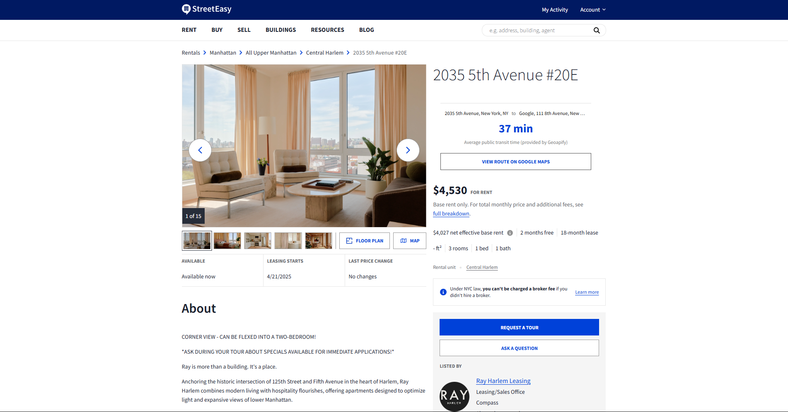
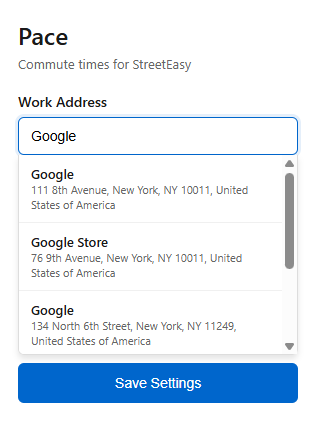
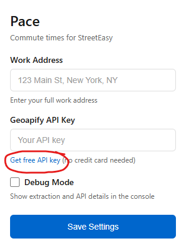
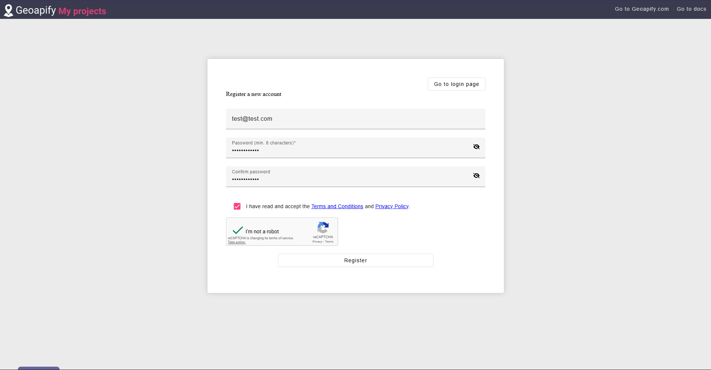
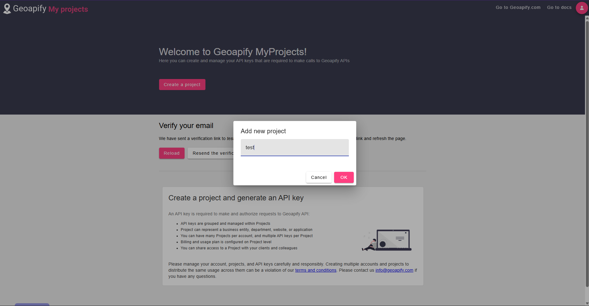
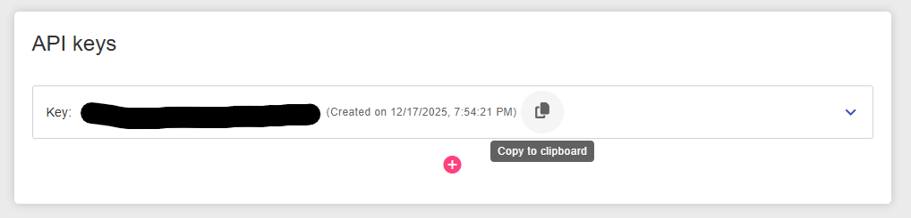
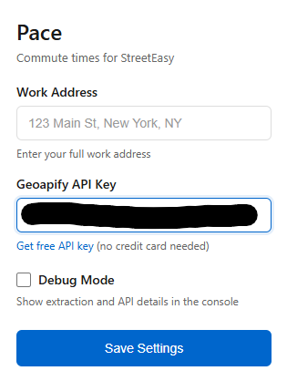
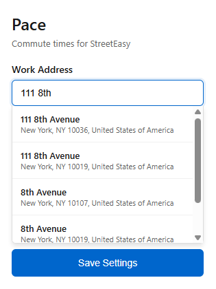
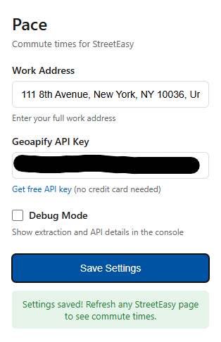

# Pace - StreetEasy Commute Times

Pace is a browser extension that automatically calculates and displays public transit commute times directly on StreetEasy apartment listings. It helps you make better decisions by showing you exactly how long it will take to get to work from any apartment you're viewing.

## Features

- **Instant Commute Calculation**: Automatically detects the apartment address and calculates the commute time to your configured work address.
- **Seamless Integration**: Displays the commute time prominently on the listing page.
- **Smart Address Search**: Includes an address autocomplete feature to easily find and set your work location.
- **Privacy Focused**: Your API key and address are stored locally in your browser.

### See it in action

**View commute times directly on listings:**

  

**Smart address autofill:**

  

## Installation

Since this extension is not yet in the Chrome Web Store, you can install it in Developer Mode:

1.  Clone or download this repository to your computer.
2.  Open Chrome and navigate to `chrome://extensions/`.
3.  Enable **Developer mode** in the top right corner.
4.  Click **Load unpacked**.
5.  Select the folder where you saved this repository (the folder containing `manifest.json`).

## Configuration

To use Pace, you need a free API key from Geoapify (free, no credit card required).

<strong>📋 Click to expand setup instructions</strong>

### 1. Get your free API Key
Open the Pace extension popup and click on **"Get free API key"**.

  

### 2. Register an account
Sign up for a free account on Geoapify.

  

### 3. Create a project
Once logged in, click on **"Create a project"** in the dashboard.

  

### 4. Name your project
Give your project a name (e.g., "Pace Extension") and click OK.

  

### 5. Copy your API Key
Copy the generated API Key from the dashboard.

  

### 6. Enter API Key
Paste the API Key into the Pace extension settings.

  

### 7. Set Work Address
Start typing your work address and select it from the dropdown menu.

  

### 8. Save Settings
Click **"Save Settings"**. You're all set! Refresh any StreetEasy listing page to see your commute times.

  

## Technologies Used

- **JavaScript (ES6+)**: Core logic for the extension.
- **Geoapify API**: Used for address geocoding and public transit routing.
- **Chrome Extension API**: Manifest V3, Storage API, Scripting.
- **HTML/CSS**: Popup interface and content injection styling.

## License

[MIT](LICENSE)
