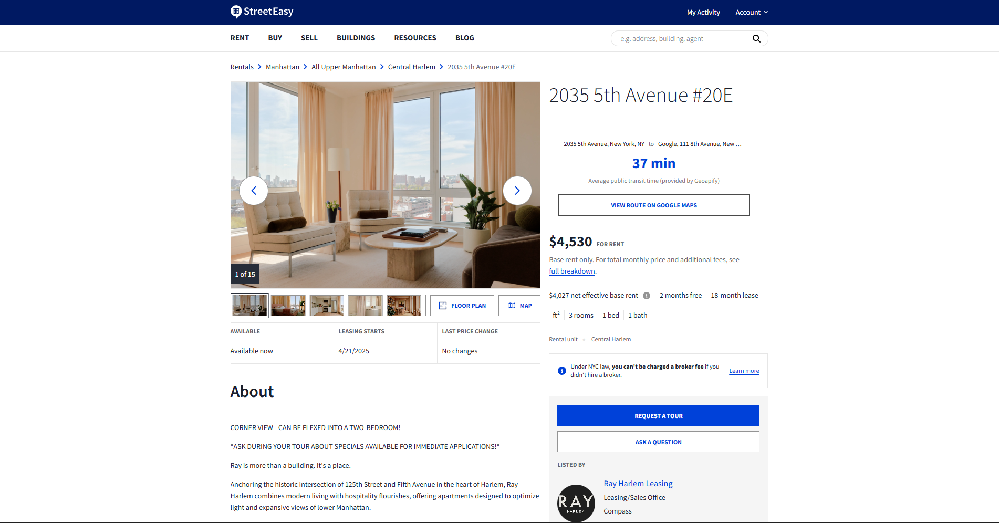
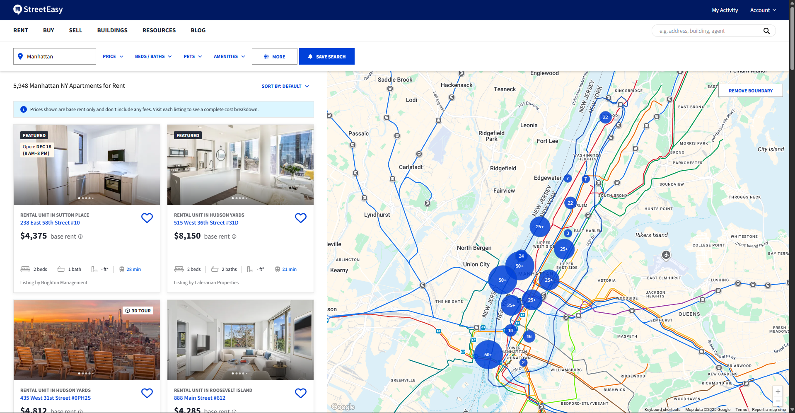

# Pace - StreetEasy Commute Times

Pace is a browser extension that automatically calculates and displays public transit commute times directly on StreetEasy apartment listings. It helps you make better decisions by showing you exactly how long it will take to get to work from any apartment you're viewing.

## Features

- **Instant Commute Calculation**: Automatically detects the apartment address and calculates the commute time to your configured work address.
- **Seamless Integration**: Displays the commute time prominently on the listing page and in search results.
- **Smart Address Search**: Includes an address autocomplete feature to easily find and set your work location.
- **Zero Config**: Works out of the box - just enter your work address and go.
- **Privacy Focused**: Your address is stored locally in your browser.

### See it in action

**View commute times directly on listings and in search results:**

  
  

## Installation

Since this extension is not yet in the Chrome Web Store, you can install it in Developer Mode:

1.  Clone or download this repository to your computer.
2.  Open Chrome and navigate to `chrome://extensions/`.
3.  Enable **Developer mode** in the top right corner.
4.  Click **Load unpacked**.
5.  Select the folder where you saved this repository (the folder containing `manifest.json`).

## Configuration

1. Click the Pace extension icon in your toolbar.
2. Type your work address and select it from the autocomplete dropdown.
3. Click **Save Settings**.
4. Refresh any StreetEasy listing page to see your commute times.

That's it! Pace includes a shared API key so there's nothing else to set up.

### Advanced: Bring Your Own API Key

The shared API key has a daily usage limit. If you hit it, you can add your own free Geoapify key:

1. Open the Pace popup and expand **Advanced Settings** at the bottom.
2. Click the link to register at [Geoapify](https://myprojects.geoapify.com/register) (free, no credit card needed).
3. Create a project and copy your API key.
4. Paste it into the API key field and save.

Your own key will be used instead of the shared one, giving you a dedicated quota.

## Technologies Used

- **JavaScript (ES6+)**: Core logic for the extension.
- **Geoapify API**: Used for address geocoding and public transit routing.
- **Cloudflare Workers**: Lightweight proxy to keep the shared API key server-side.
- **Chrome Extension API**: Manifest V3, Storage API, Scripting.
- **HTML/CSS**: Popup interface and content injection styling.

## License

[MIT](LICENSE)
